# :memo: tc3002b_Modulo2_IA
En este repositorio se alojarán todos los archivos del Módulo 2 de la materia de Desarrollo de aplicaciones avanzadas de ciencias computacionales

## :dart: Food Classification

### :book: Dataset

El conjunto de datos utilizado en este proyecto fue creado por Harish Kumar y se obtuvo del conjunto de datos de Kaggle conocido como [Food Image Classification Dataset](https://www.kaggle.com/datasets/harishkumardatalab/food-image-classification-dataset)

El objetivo principal de este modelo es clasificar 13 categorías diferentes de platillos de comida.

### :wrench: Estructura del dataset

Originalmente, el conjunto de datos de Kaggle incluía 35 clases de platillos, pero para este modelo se redujo a 13 debido a que varias clases tenían un número bajo de imágenes. 
Las clases seleccionadas poseen una diferencia de imágenes aceptable. A continuación se da información sobre las clases y la cantidad de imágenes que son las siguientes:

| Clase          | Cantidad de imágenes|
| -------------- | ------------------- |
| Baked Potato   | 1500                |
| Crispy Chicken | 1500                |
| Donut          | 1500                |
| Fries          | 1500                |
| Hot Dog        | 1500                |
| Sandwich       | 1500                |
| Taco           | 1500                |
| Apple Pie      | 1000                |
| Cheesecake     | 1000                |
| Chicken Curry  | 1000                |
| Ice Cream      | 1000                |
| Omelette       | 1000                |
| Sushi          | 1000                |

En el conjunto original de Kaggle, cada clase contiene imágenes sin una estructura definida. Con el fin de mejorar la eficiencia del desarrollo del modelo y reducir posibles desequilibrios, las imágenes de las clases se dividirán en tres categorías principales:

* **Train (Entrenamiento):** Esta categoría se utilizará para entrenar el modelo y contendrá el 70% de las imágenes de cada clase. Se estima que habrá aproximadamente 11,550 imágenes en esta categoría.

* **Validation (Validación):** Aquí se evaluará el rendimiento del modelo durante el entrenamiento, lo que permitirá ajustar los hiperparámetros del modelo antes de pasar a la fase de prueba. Esto nos ayuda a evitar problemas de overfitting (sobreajuste) o underfitting (subajuste) del modelo. La categoría de validación contendrá el 15% de las imágenes de cada clase, aproximadamente 2,475 imágenes.

  **Overfitting (sobreajuste):** Ocurre cuando un modelo se ajusta demasiado bien a los datos de entrenamiento, lo que resulta en un bajo rendimiento con nuevos datos no vistos previamente.

  **Underfitting (subajuste):** Ocurre cuando un modelo es demasiado simple para capturar la estructura subyacente de los datos. 

* **Test (Prueba):** Esta categoría permitirá evaluar el rendimiento del modelo frente a imágenes que nunca ha visto durante la fase de entrenamiento. Contendrá también el 15% de las imágenes de cada clase, aproximadamente 2,475 imágenes.

El conjunto original de datos no venía segmentado en las categorías previamente descritas por lo que se desarolló un archivo de python llamado "data_split.py" para hacer la división de las imágenes.

## :triangular_ruler: Preprocesamiento de los datos

El preprocesamiento de imágenes es una fase relevante para preparar los datos antes de entrenar un modelo de clasificación de imágenes. 

En este proyecto, se utiliza ImageDataGenerator de TensorFlow para realizar una serie de transformaciones en las imágenes del conjunto de datos.

#### **Detalles del Preprocesamiento**

* **Redimensionamiento de Imágenes:** Todas las imágenes se redimensionan a 150x150 píxeles para asegurar una entrada consistente en el modelo, independientemente de las dimensiones originales de las imágenes.

* **Normalización de los valores de los píxeles:** En el preprocesamiento de imágenes para modelos de aprendizaje profundo, una práctica común es escalar los valores de los píxeles de las imágenes al rango [0, 1]. Esto se logra dividiendo cada valor de píxel por 255.

* **Data Augmentation (Aumento de Datos):** Data augmentation se utiliza para incrementar la diversidad del conjunto de datos de entrenamiento mediante la aplicación de transformaciones aleatorias. En este proyecto se establecieron las siguientes transformaciones en el conjunto de entrenamiento, tanto las transformaciones como los valores asignados fueron elegidos con base en el artículo desarrollado por Chiranjibi Sitaula and Mohammad Belayet Hossain [4]:

  * **Rotation (Rotación):** Las imágenes pueden rotar hasta 90 grados.
  * **Width and height shift (Desplazamiento Horizontal y Vertical) :** Las imágenes pueden desplazarse horizontalmente y verticalmente hasta un 20% de su tamaño.
  * **Shear (Corte):** La transformación de corte es una operación geométrica que distorsiona la forma de una imagen. La transformación de corte puede variar aleatoriamente hasta un máximo de aproximadamente 0.2 radianes(11.46 grados).
  * **Zoom:** Las imágenes pueden ser ampliadas hasta un 20%.
  * **Horizontal flip (volteo Horizontal):** Las imágenes pueden ser volteadas horizontalmente.

* **Generador de Datos:** ImageDataGenerator genera lotes de datos de imágenes con un tamaño de 16 imágenes por lote. Cabe resaltar que para fines didácticos en el archivo "model_preprocess.py" se desarrolla una estructura donde se guarda ejemplos de imágenes aumentadas en la carpeta "augmented" con el prefijo aug y en formato PNG.

  * **Class mode (modo de clase):** Este parámetro especifica el formato de las etiquetas que se generarán para los datos. Este parámetro es crucial para determinar cómo se estructuran las etiquetas de salida de las imágenes cargadas y se utiliza para adaptar la forma de las etiquetas a la arquitectura del modelo.En este caso, debido a que el modelo tiene el propósito de clasificar diversas clases, es estableció el parámetro de categorical.

A su vez, en el mismo archivo hay una estructura para imprimir alrededor de 20 imágenes, usando librerías de python como numpy y matplotlib, en caso de que no se quiera guardar las imágenes en el dispositivo que se ejecute el código. A continuación se muestra un ejemplo de la imagen que se genera.

En el archivo "model.py", se mantiene la misma arquitectura descrita anteriormente para el preprocesamiento de las imágenes de entrenamiento. Sin embargo, se ha agregado un preprocesamiento similar para los conjuntos de validación y prueba. Es importante destacar que estos preprocesamientos adicionales contienen una arquitectura simplificada que conserva únicamente las etapas de redimensionamiento y normalización, así como la configuración del modo de clase.

Esto se debe a que en los conjuntos de validación y prueba, se busca evaluar el rendimiento del modelo con datos "reales", es decir, imágenes que sean representativas de las condiciones que encontrará el modelo en la práctica. 

Por lo tanto, se evitan las transformaciones excesivas en estas imágenes, como rotaciones y zoom, para garantizar que las métricas de rendimiento reflejen con precisión la capacidad del modelo para generalizar a datos no vistos sin influencias artificiales. 
En otras palabras, al mantener los conjuntos de validación y prueba lo más cercanos posible a datos "reales", se obtiene una evaluación más precisa del rendimiento del modelo en situaciones del mundo real.

## :construction: Construcción del Modelo

En este proyecto se ha construido un modelo de Red Neuronal Convolucional (CNN) utilizando el framework de Tensorflow (versión 2.13.0) y la librería keras (versión 2.13.1). Las capas del modelo son las siguientes y fueron inspiradas por los modelos desarrollados en los artículos [3] y [4]:

  * **Modelo Base:** Se implementó la arquitectura VGG16 como nuestro modelo base. VGG16 es una arquitectura de red neuronal convolucional (CNN) que ha sido ampliamente utilizada en el campo del aprendizaje profundo. Fue desarrollada por el grupo Visual Geometry Group (VGG) en la Universidad de Oxford y es conocida por su profundidad y su capacidad para aprender representaciones de características de imágenes.

    La arquitectura VGG16 se caracteriza por tener 16 capas de pesos, incluyendo 13 capas convolucionales y 3 capas completamente conectadas. Utiliza convoluciones 3x3 con un paso y un relleno (padding) de 1, y max-pooling 2x2 para reducir la dimensionalidad espacial. VGG16 se ha utilizado principalmente para tareas de clasificación de imágenes, como el reconocimiento de objetos en imágenes y la identificación de categorías.[3]

    Dicha arquitectura viene preentrenada con el conjunto de datos "ImageNet". En adición a esto, otro parámetro configurado dentro de esta capa es "include_top=False", lo cuál significa que excluimos las capas densas finales del modelo base, permitiéndonos añadir nuestras propias capas personalizadas para adaptar el modelo a nuestras necesidades. Además, definimos la forma de entrada con "input_shape=(width, height, 3)" para que coincida con las dimensiones de nuestras imágenes.

    Por último, establecemos conv_base.trainable = True para permitir que los pesos del modelo base se actualicen durante el entrenamiento, lo que puede mejorar el rendimiento al ajustarse a las imágenes del proyecto.

  * **Capa Global Average Pooling:** Posteriormente, agregamos una capa de Global Average Pooling 2D para reducir la dimensionalidad de las características extraídas y generar una representación compacta de la información visual. Esta capa promedia espacialmente las características en cada canal, produciendo una representación más manejable y reduciendo el riesgo de sobreajuste.

  * **Capas Densas Adicionales:** Por último, añadimos capas densas adicionales para la clasificación. Comenzamos con una capa densa con 256 unidades y función de activación ReLU, que ayuda a aprender representaciones no lineales en los datos. Esta capa permite al modelo capturar patrones complejos en las características visuales extraídas por VGG16. 

    Finalmente, agregamos una capa densa de salida con 13 unidades y función de activación softmax. Esta capa produce una distribución de probabilidad sobre las clases objetivo, permitiendo la clasificación de las entradas en una de las 13 categorías posibles.

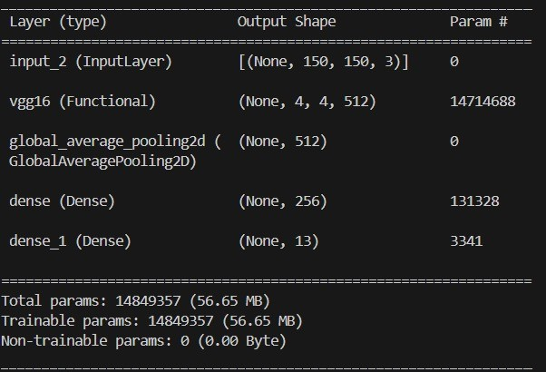

## :triangular_flag_on_post: Compilación del modelo

Una vez que hemos definido la arquitectura del modelo, el siguiente paso crucial es compilarlo. La compilación del modelo implica especificar tres elementos clave: la función de pérdida, el optimizador y las métricas de evaluación. Estos componentes determinan cómo se entrenará el modelo y cómo se evaluará su rendimiento durante y después del entrenamiento.

  * **Función de Pérdida:** La función de pérdida seleccionada es categorical_crossentropy[4]. Esta función de pérdida es adecuada para problemas de clasificación multiclase, donde las etiquetas de las clases están codificadas de manera categórica (one-hot encoding). 

    Categorical_crossentropy calcula la diferencia entre la distribución de probabilidad predicha por el modelo y la distribución de probabilidad real de las clases.

  * **Optimizador:** El optimizador elegido es Adam[4], que es una versión avanzada del descenso de gradiente estocástico. Adam (Adaptive Moment Estimation) combina las ventajas de dos otros métodos de optimización populares: AdaGrad y RMSProp. Utiliza momentos adaptativos de primer y segundo orden, lo que permite ajustes individuales de la tasa de aprendizaje para cada parámetro del modelo. Dentro del optimizador, definimos el hiperparámetro de "learning rate".

    * **Learning Rate (Tasa de Aprendizaje):** La tasa de aprendizaje especificada es 0.0001[4]. Esta tasa de aprendizaje es relativamente baja, lo que puede resultar en un entrenamiento más lento pero más estable.

  * **Métrica de evaluación:** La métrica de evaluación seleccionada es accuracy, que representa la exactitud del modelo. La exactitud mide la proporción de predicciones correctas realizadas por el modelo en comparación con el número total de predicciones. 

  Es una métrica simple y comúnmente utilizada para problemas de clasificación, ya que proporciona una indicación directa de cuán bien está funcionando el modelo en términos de predicción de clases correctas[4].

  Esta arquitectura fue implementada en el archivo de python llamado "model.py".

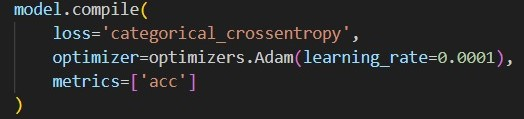

## :hotsprings: Entrenamiento del modelo

El proceso de entrenamiento del modelo implica ajustar los pesos del modelo utilizando datos de entrenamiento, con el objetivo de minimizar la función de pérdida y mejorar el rendimiento del modelo en términos de la métrica especificada. En este caso, utilizamos la función "fit" de Keras para entrenar el modelo con los datos de entrenamiento y validación.

* **Parámetros de Entrenamiento:**
  
  * **train_generator:** Mandamos a llamar a la generación de imágenes modificadas previamente descritas en "Data Augmentation".
  
  * **val_generator:** Mandamos a llamar a la generación de imágenes previamente descritas en "Generador de imágenes".

  * **steps_per_epoch:** Este parámetro define el número de pasos (batches) de entrenamiento que el modelo ejecutará en cada época. Cada paso procesa un lote de datos y actualiza los pesos del modelo. En este caso, 30 pasos por época significa que el generador de entrenamiento proporcionará 30 lotes de datos en cada época.

  * **epochs:** El número de épocas indica cuántas veces el modelo verá todo el conjunto de datos de entrenamiento. Con 60 épocas, el modelo realizará 60 ciclos completos a través de los datos de entrenamiento.

  * **validation_steps:** Similar a steps_per_epoch, este parámetro define el número de pasos de validación que el modelo ejecutará al final de cada época. Cada paso de validación procesa un lote de datos de validación para evaluar el rendimiento del modelo. En este caso, 30 pasos de validación se ejecutan al final de cada época.

 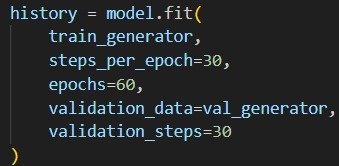

## :mag_right: Análisis de los resultados de la primera iteración

Al evaluar el rendimiento del modelo, es fundamental observar tanto las métricas de entrenamiento como las de validación para comprender cómo está aprendiendo el modelo y si está generalizando bien a datos no vistos. A continuación se presentan las métricas obtenidas:

  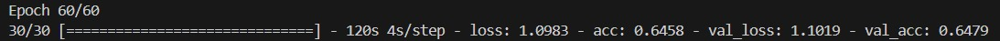
  
  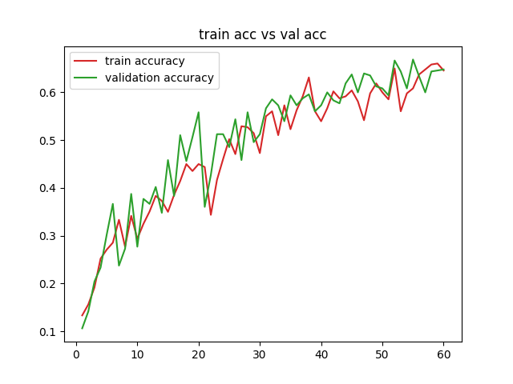
  
  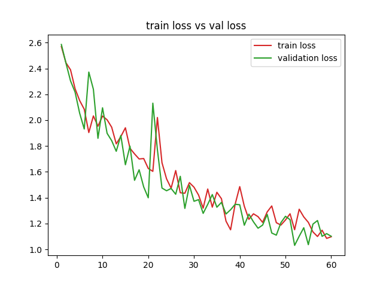

  * Train Accuracy (Exactitud de Entrenamiento): 64.58%
  * Train Loss (Pérdida de Entrenamiento): 1.0983
  * Validation Accuracy (Exactitud de Validación): 64.79%
  * Validation Loss (Pérdida de Validación): 1.1019

  La exactitud de entrenamiento indica que el modelo clasifica correctamente el 64.58% de los ejemplos en el conjunto de datos de entrenamiento.

  La exactitud de validación muestra que el modelo clasifica correctamente el 64.79% de los ejemplos en el conjunto de datos de validación.

  La cercanía entre la exactitud de entrenamiento y la de validación sugiere que el modelo está aprendiendo de manera consistente y no está sobreajustando los datos de entrenamiento. 

  El hecho de que ambas métricas sean similares es una buena señal de que el modelo puede generalizar bien a datos no vistos.

  De igual forma, la pequeña diferencia entre la pérdida de entrenamiento y la pérdida de validación sugiere que el modelo no está sobreajustando y que el nivel de error es consistente entre los datos de entrenamiento y los de validación.

Para confirmar la capacidad de generalización del modelo, evaluamos su rendimiento con el conjunto de purebas:

  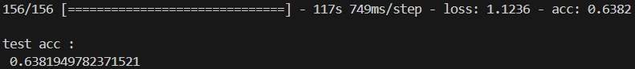

  * Test Accuracy (Exactitud de Prueba): 63.82%
  * Test Loss (Pérdida de Prueba): 1.1236

  La exactitud muestra que el modelo clasifica correctamente el 64.79% de los ejemplos en el conjunto de datos de prueba.
  
  Aunque es ligeramente inferior a la exactitud de validación, la diferencia no es significativa, lo que sugiere que el modelo mantiene su rendimiento en datos no vistos.

  De igual forma, la pérdida de prueba es un poco mayor que la pérdida de validación, pero la diferencia no es sustancial. Esto indica que el modelo tiene un rendimiento estable y consistente también en el conjunto de datos de prueba.

### Reporte de clasificación

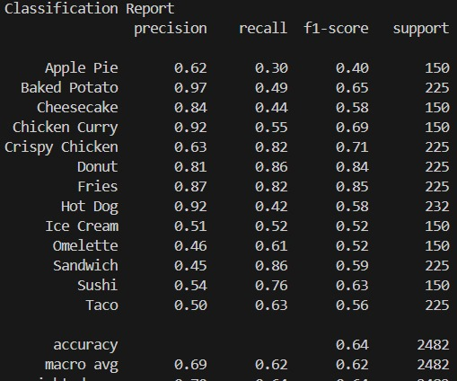

* Apple Pie: Tiene una precisión de 0.62 y una sensibilidad(recall) de 0.30, lo que resulta en una puntuación F1 de 0.40. Esto sugiere que aunque el modelo predice esta clase con cierta exactitud, no lo hace con mucha frecuencia.

* Baked Potato: Alta precisión (0.97) pero baja sensibilidad(recall) (0.49), lo que indica que mientras el modelo predice correctamente las instancias de esta clase cuando lo hace, no logra identificar muchas de las instancias reales.

* Cheesecake: Una precisión de 0.84 y sensibilidad(recall) de 0.44, lo que indica un desequilibrio similar al de Baked Potato.

* Chicken Curry: Buen equilibrio con precisión de 0.92 y sensibilidad(recall) de 0.55.

* Fried Chicken: Inverso a las anteriores, con una precisión más baja (0.63) pero alta sensibilidad(recall) (0.82), sugiriendo que el modelo identifica muchas instancias pero con más falsos positivos.

* Donut: Buen rendimiento con alta precisión y sensibilidad(recall), reflejado en la alta puntuación de F1 (0.84).

* French Fries: Buen rendimiento con alta precisión y sensibilidad(recall), reflejado en la alta puntuación de F1 (0.85).

* Hot Dog: Alta precisión (0.92) pero baja sensibilidad(recall) (0.42), similar a Baked Potato.

* Ice cream: La precisión (0.51) y la sensibilidad(recall) (0.52) son moderadas, lo que indica que el modelo tiene un rendimiento medio.

* Omelette: La precisión es baja (0.46), pero la sensibilidad(recall) es relativamente mejor (0.61), indicando que el modelo identifica varias instancias de la clase pero también comete muchos errores de predicción.

* Sandwich: La precisión es baja (0.45), pero la alta sensibilidad(recall) (0.86) sugiere que el modelo detecta varias instancias de la clase, aunque con muchos falsos positivos.

* Sushi: Un buen equilibrio con una precisión moderada (0.54) y alta sensibilidad(recall) (0.76), indicando un rendimiento decente del modelo en esta clase.

* Taco: Moderada precisión (0.50) y sensibilidad(recall) (0.63), indicando un rendimiento aceptable, aunque aún puede mejorar.

### Matriz de Confusión

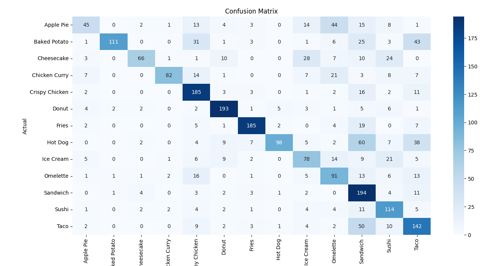

* Apple Pie:
  * Prediciones correctas: 45
  * Clasificaciones erróneas: Confundido frecuentemente con "Omelette" (44) y "Sandwich" (15).

* Baked Potato:
  * Prediciones correctas: 111
  * Clasificaciones erróneas: Confundido con "Crispy Chicken" (31) y "Taco" (43).

* Cheesecake:
  * Prediciones correctas: 66
  * Clasificaciones erróneas: Confundido con "Ice Cream" (28) y "Sushi" (24).

* Chicken Curry:
  * Prediciones correctas: 82
  * Clasificaciones erróneas: Confundido con "Omelette" (21) y "Crispy Chicken" (14).

* Crispy Chicken:
  * Prediciones correctas: 185
  * Clasificaciones erróneas: Confundido con "Sandwich" (16) y "Taco" (11).

* Donut:
  * Prediciones correctas: 193
  * Clasificaciones erróneas: Confundido con "Sandwich" (5) y "Sushi" (6).

* French Fries:
  * Prediciones correctas: 185
  * Clasificaciones erróneas: Confundido con "Sandwich" (19) y "Taco" (7).

* Hot Dog:
  * Prediciones correctas: 98
  * Clasificaciones erróneas: Confundido con "Sandwich" (60) y "Taco" (38).

* Ice Cream:
  * Prediciones correctas: 78
  * Clasificaciones erróneas: Confundido con "Omelette" (14) y "Sushi" (21).

* Omelette:
  * Prediciones correctas: 91
  * Clasificaciones erróneas: Confundido con "Sandwich" (13) y "Crispy Chicken" (16).

* Sandwich:
  * Prediciones correctas: 194
  * Clasificaciones erróneas: Confundido con "Taco" (11) y "Sushi" (4).

* Sushi:
  * Prediciones correctas: 114
  * Clasificaciones erróneas: Confundido con "Taco" (5) y "Sandwich" (11).

* Taco:
  * Prediciones correctas: 142
  * Clasificaciones erróneas: Confundido con "Sandwich" (50) y "Sushi" (10).    

## Conclusiones de la primera iteración

Las métricas obtenidas muestran que el modelo está aprendiendo de manera constante y a un ritmo adecuado. 

Sin embargo, una exactitud en el rango del 64%, las métricas del reporte de clasificación y la matriz de confusión, indican que hay margen para mejorar. Posibles pasos para mejorar el rendimiento podrían incluir:

* Ajuste de Hiperparámetros: Experimentar con diferentes tasas de aprendizaje, arquitecturas de red o regularización.
* Fine-Tuning del Modelo Base: Ajustar finamente las capas del modelo preentrenado con una tasa de aprendizaje baja para mejorar el aprendizaje específico del dominio.

El modelo está funcionando de manera razonablemente buena, pero con ajustes y mejoras adicionales, se puede aspirar a un rendimiento más alto.

## :chart_with_upwards_trend: Refinamiento del Modelo, en búsqueda de mejoras.

En esta fase se usa la misma estructura para el preprocesamiento de datos, data augmentation y generación de datos.

De igual forma, se usa como base la arquitectura del modelo descrito anteriormente. No obstante, con el objetivo de mejorar el rendimiento del modelo en la clasificación de las clases, se implementaron los siguientes cambios:

* **Capa de Flatten:** Usando como inspiración la aqruitectura implementada en el artículo [4], se implementó una capa de flatten que en la primera iteración de este modelo fue omitida por cuestiones del tiempo de entrenamiento del modelo.

* **Capa Densa Adicional:** Añadimos una capa densa con 512 neuronas y función de activación ReLU para capturar representaciones complejas de los datos.

* **Learning Rate:** Se modificó el learning rate de 0.0001 a 0.00001.

* **Steps per Epoch:** Se aumentó el número de 30 a 50 para proporcionar más iteraciones en cada época, mejorando la exposición del modelo a los datos de entrenamiento.

Estas modificaciones fueron implementadas en el archivo de python llamado "modelRefinement.py".

## :mag_right: Análisis de los resultados de la segunda iteración

A continuación se presentan las métricas obtenidas:

  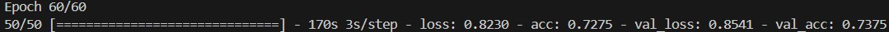
  
  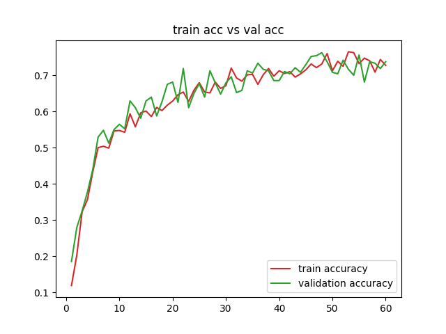
  
  

  * Train Accuracy (Exactitud de Entrenamiento): 72.75%
  * Train Loss (Pérdida de Entrenamiento): 0.8230
  * Validation Accuracy (Exactitud de Validación): 73.75%
  * Validation Loss (Pérdida de Validación): 0.8541

  La exactitud de entrenamiento ha mejorado significativamente, pasando de 64.58% a 72.75%, indicando que el modelo es ahora más capaz de clasificar correctamente los ejemplos en el conjunto de datos de entrenamiento.

  La pérdida de entrenamiento ha disminuido notablemente, pasando de 1.0983 a 0.8230, lo que sugiere que el modelo refinado tiene un mejor ajuste y está aprendiendo con mayor efectividad durante el entrenamiento.

  El mismo patrón sucede con las métricas de validación, donde la exactitud pasó de 64.79% a 73.75% y la pérdida pasó de 1.1019 a 0.8541.

  Estos valores indican que el modelo refinado tiene una mejora significativa en la capacidad del modelo para aprender patrones y características relevantes de las clases de comida. 
  
  A su vez, la reducción en la pérdida sugiere que el modelo está optimizando de manera más efectiva los parámetros internos para ajustarse a los datos.

  Asimismo, las métricas de entrenamiento y validación del modelo refinado no poseen tanta diferencia, lo cuál indica que este modelo mantiene su rendimiento en datos no vistos y tampoco se está sobreajustando a los datos de entrenamiento.
  
Ahora se analizarán los resultados obtenidos en la fase de prueba:

  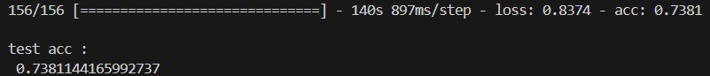

  * Test Accuracy (Exactitud de Prueba): 73.82%
  * Test Loss (Pérdida de Prueba): 0.8374

  La exactitud de prueba del modelo refinado es significativamente mayor, pasando de 63.82% a 73.82%. Esto confirma que el modelo tiene mejor eficiencia con datos no vistos. Este resultado es coherente con las métricas de validación
  
  La pérdida de prueba ha disminuido notablemente, pasando de 1.1236 a 0.8374, confirmando que el modelo no posee indicios de sobreajuste y demostrando que tiene un mejor rendimiento al modelo inicial.

  ### Reporte de clasificación del modelo refinado

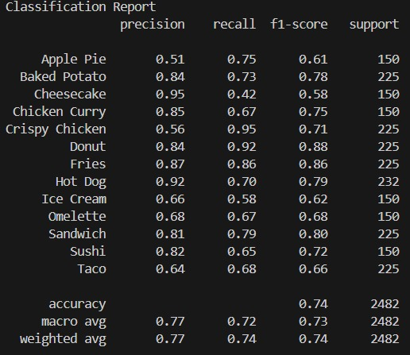

* **Apple Pie**
  * Modelo Inicial:
    * Precisión: 0.62
    * Recall: 0.30
    * F1-Score: 0.40
  * Modelo Refinado:
    * Precisión: 0.51
    * Recall: 0.75
    * F1-Score: 0.61

* **Baked Potato**
  * Modelo Inicial:
    * Precisión: 0.97
    * Recall: 0.49
    * F1-Score: 0.65
  * Modelo Refinado:
    * Precisión: 0.84
    * Recall: 0.78
    * F1-Score: 0.81

* **Cheesecake**
  * Modelo Inicial:
    * Precisión: 0.84
    * Recall: 0.44
    * F1-Score: 0.58
  * Modelo Refinado:
    * Precisión: 0.95
    * Recall: 0.42
    * F1-Score: 0.58

* **Chicken Curry**
  * Modelo Inicial:
    * Precisión: 0.92
    * Recall: 0.55
    * F1-Score: 0.69
  * Modelo Refinado:
    * Precisión: 0.85
    * Recall: 0.67
    * F1-Score: 0.75

* **Crispy Chicken**
  * Modelo Inicial:
    * Precisión: 0.63
    * Recall: 0.82
    * F1-Score: 0.71
  * Modelo Refinado:
    * Precisión: 0.56
    * Recall: 0.95
    * F1-Score: 0.70

* **Donut**
  * Modelo Inicial:
    * Precisión: 0.81
    * Recall: 0.86
    * F1-Score: 0.84
  * Modelo Refinado:
    * Precisión: 0.84
    * Recall: 0.92
    * F1-Score: 0.88

* **Fries**
  * Modelo Inicial:
    * Precisión: 0.87
    * Recall: 0.82
    * F1-Score: 0.85
  * Modelo Refinado:
    * Precisión: 0.87
    * Recall: 0.86
    * F1-Score: 0.86

* **Hot Dog**
  * Modelo Inicial:
    * Precisión: 0.92
    * Recall: 0.42
    * F1-Score: 0.58
  * Modelo Refinado:
    * Precisión: 0.92
    * Recall: 0.70
    * F1-Score: 0.79

* **Ice Cream**
  * Modelo Inicial:
    * Precisión: 0.51
    * Recall: 0.52
    * F1-Score: 0.52
  * Modelo Refinado:
    * Precisión: 0.66
    * Recall: 0.58
    * F1-Score: 0.62

* **Omelette**
  * Modelo Inicial:
    * Precisión: 0.46
    * Recall: 0.61
    * F1-Score: 0.52
  * Modelo Refinado:
    * Precisión: 0.68
    * Recall: 0.67
    * F1-Score: 0.68

* **Sandwich**
  * Modelo Inicial:
    * Precisión: 0.45
    * Recall: 0.86
    * F1-Score: 0.59
  * Modelo Refinado:
    * Precisión: 0.81
    * Recall: 0.79
    * F1-Score: 0.80

* **Sushi**
  * Modelo Inicial:
    * Precisión: 0.54
    * Recall: 0.76
    * F1-Score: 0.63
  * Modelo Refinado:
    * Precisión: 0.78
    * Recall: 0.78
    * F1-Score: 0.78

* **Taco**
  * Modelo Inicial:
    * Precisión: 0.50
    * Recall: 0.63
    * F1-Score: 0.56
  * Modelo Refinado:
    * Precisión: 0.64
    * Recall: 0.68
    * F1-Score: 0.66

### Matriz de Confusión del modelo refinado

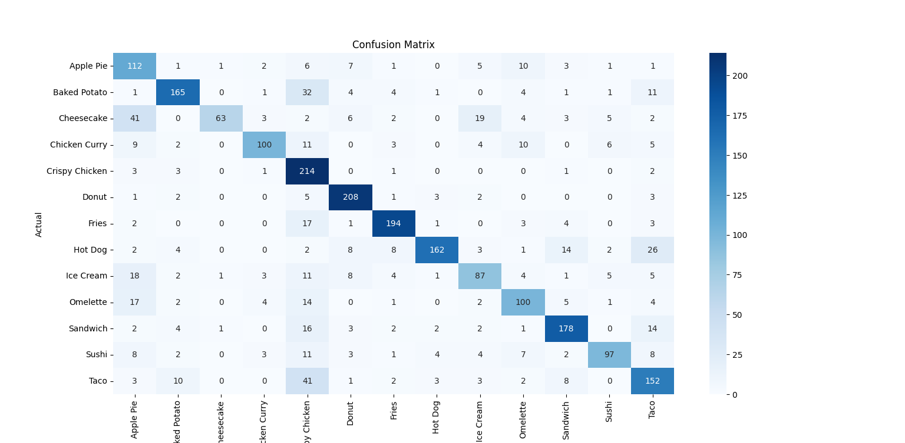

* Apple Pie:
  * Modelo inicial:
    * Prediciones correctas: 45
    * Clasificaciones erróneas: Confundido frecuentemente con "Omelette" (44) y "Sandwich" (15).
  * Modelo refinado:
    * Prediciones correctas: 112
    * Clasificaciones erróneas: Confundido frecuentemente con "Omelette" (10) y "Donut" (7).

* Baked Potato:
  * Modelo inicial:
    * Prediciones correctas: 111
    * Clasificaciones erróneas: Confundido con "Crispy Chicken" (31) y "Taco" (43).
  * Modelo refinado:
    * Prediciones correctas: 165
    * Clasificaciones erróneas: Confundido frecuentemente con "Crispy Chicken" (32) y "Taco" (11).

* Cheesecake:
  * Modelo inicial:
    * Prediciones correctas: 66
    * Clasificaciones erróneas: Confundido con "Ice Cream" (28) y "Sushi" (24).
  * Modelo refinado:
    * Prediciones correctas: 63
    * Clasificaciones erróneas: Confundido frecuentemente con "Apple Pie" (41) y "Ice Cream" (19).

* Chicken Curry:
  * Modelo inicial:
    * Prediciones correctas: 82
    * Clasificaciones erróneas: Confundido con "Omelette" (21) y "Crispy Chicken" (14).
  * Modelo refinado:
    * Prediciones correctas: 100
    * Clasificaciones erróneas: Confundido frecuentemente con "Crispy Chicken" (11) y "Omelette" (10).

* Crispy Chicken:
  * Modelo inicial:
    * Prediciones correctas: 185
    * Clasificaciones erróneas: Confundido con "Sandwich" (16) y "Taco" (11).
  * Modelo refinado:
    * Prediciones correctas: 214
    * Clasificaciones erróneas: Confundido frecuentemente con "Apple Pie" (3) y "Baked Potato" (3).

* Donut:
  * Modelo inicial:
    * Prediciones correctas: 193
    * Clasificaciones erróneas: Confundido con "Sandwich" (5) y "Sushi" (6).
  * Modelo refinado:
    * Prediciones correctas: 208
    * Clasificaciones erróneas: Confundido frecuentemente con "Taco" (3) y "Crispy Chicken" (5).

* French Fries:
  * Modelo inicial:
    * Prediciones correctas: 185
    * Clasificaciones erróneas: Confundido con "Sandwich" (19) y "Taco" (7).
  * Modelo refinado:
    * Prediciones correctas: 194
    * Clasificaciones erróneas: Confundido frecuentemente con "Crispy Chicken" (17) y "Sandwich" (4).

* Hot Dog:
  * Modelo inicial:
    * Prediciones correctas: 98
    * Clasificaciones erróneas: Confundido con "Sandwich" (60) y "Taco" (38).
  * Modelo refinado:
    * Prediciones correctas: 162
    * Clasificaciones erróneas: Confundido frecuentemente con "Taco" (26) y "Sandwich" (14).

* Ice Cream:
  * Modelo inicial:
    * Prediciones correctas: 78
    * Clasificaciones erróneas: Confundido con "Omelette" (14) y "Sushi" (21).
  * Modelo refinado:
    * Prediciones correctas: 87
    * Clasificaciones erróneas: Confundido frecuentemente con "Apple Pie" (18) y "Crispy Chicken" (11).

* Omelette:
  * Modelo inicial:
    * Prediciones correctas: 91
    * Clasificaciones erróneas: Confundido con "Sandwich" (13) y "Crispy Chicken" (16).
  * Modelo refinado:
    * Prediciones correctas: 100
    * Clasificaciones erróneas: Confundido frecuentemente con "Apple Pie" (17) y "Crispy Chicken" (14).

* Sandwich:
  * Modelo inicial:
    * Prediciones correctas: 194
    * Clasificaciones erróneas: Confundido con "Taco" (11) y "Sushi" (4).
  * Modelo refinado:
    * Prediciones correctas: 178
    * Clasificaciones erróneas: Confundido frecuentemente con "Crispy Chicken" (16) y "Taco" (14).

* Sushi:
  * Modelo inicial:
    * Prediciones correctas: 114
    * Clasificaciones erróneas: Confundido con "Taco" (5) y "Sandwich" (11).
  * Modelo refinado:
    * Prediciones correctas: 97
    * Clasificaciones erróneas: Confundido frecuentemente con "Crispy Chicken" (11) y "Taco" (8).

* Taco:
  * Modelo inicial:
    * Prediciones correctas: 142
    * Clasificaciones erróneas: Confundido con "Sandwich" (50) y "Sushi" (10).    
  * Modelo refinado:
    * Prediciones correctas: 152
    * Clasificaciones erróneas: Confundido frecuentemente con "Crispy Chicken" (41) y "Baked Potato" (10).

## :bulb: Demostración del rendimiento de los modelos.

En esta última sección, se decidió evaluar el modelo utilizando diversas imágenes de diferentes clases de comida obtenidas de internet, y comparar el rendimiento con dichas imágenes.

Para ello, se desarrolló un script llamado "Test_Food_Model.ipynb". En este script, se cargaron los modelos guardados en formato ".keras" junto con las imágenes correspondientes. Las imágenes se imprimieron junto con las predicciones hechas por los modelos y sus categorías originales.

### Modelo 1 

### Modelo Refinado

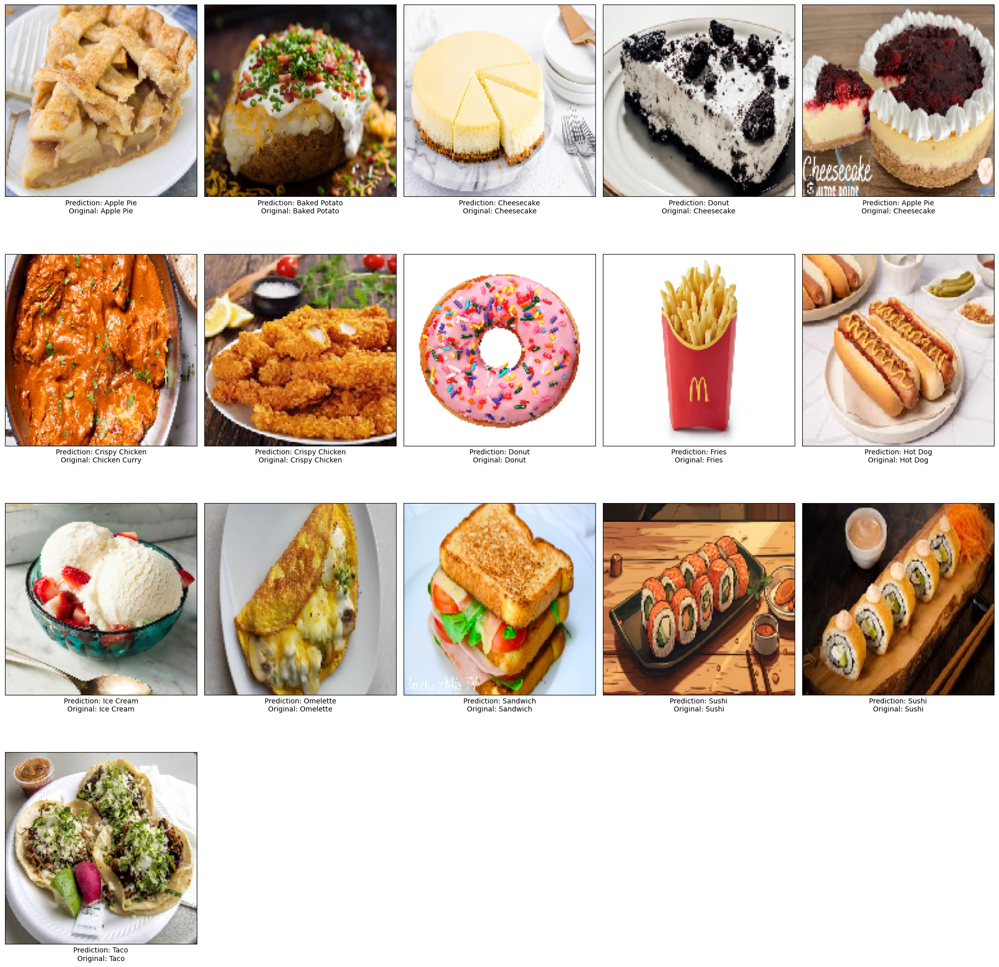

Como se puede observar en las imágenes de los resultados, ambos modelos presentan un rendimiento similar. Sin embargo, el primer modelo cometió errores en la clasificación de "Apple Pie", "Ice Cream" y "Sushi". Estos errores no ocurrieron con el modelo refinado, aunque este último mantiene otros errores similares al primer modelo, como en la clasificación de "Chicken Curry" y algunas imágenes de "Cheesecake".

## Conclusiones de la segunda iteración

El modelo refinado muestra mejoras sustanciales en todas las métricas clave (exactitud y pérdida) tanto en los conjuntos de datos de entrenamiento, validación y prueba. La consistencia entre las métricas de entrenamiento, validación y prueba refuerza la idea de que el modelo refinado es más robusto y confiable.

Asimismo, el modelo refinado muestra una mejora significativa en la clasificación de todas las clases en comparación con el modelo inicial. Las predicciones correctas han aumentado notablemente en cada categoría, y las clasificaciones erróneas se han reducido

Estos resultados sugieren que los refinamientos realizados, como la adición de una capa de Flatten, una capa densa de 512 neuronas, el ajuste de la tasa de aprendizaje y el aumento de los steps per epoch, han sido efectivos para mejorar la capacidad del modelo.

## :closed_book: Referencias bibliográficas

* [1] Q. Li, W. Cai, X. Wang, Y. Zhou, D.Feng, and M. Chen, “Medical image classification with convolutional neural network,” Dec. 2014, doi: https://doi.org/10.1109/icarcv.2014.7064414.

* [2] P. ‌Dhruv and S. Naskar, “Image Classification Using Convolutional Neural Network (CNN) and Recurrent Neural Network (RNN): A Review,” Advances in intelligent systems and computing, pp. 367–381, Jan. 2020, doi: https://doi.org/10.1007/978-981-15-1884-3_34.

* [3] Dheeb Albashish, Rizik Al-Sayyed, A. Abdullah, Mohammad Hashem Ryalat, and Nedaa Ahmad Almansour, “Deep CNN Model based on VGG16 for Breast Cancer Classification,” Jul. 2021, doi: https://doi.org/10.1109/icit52682.2021.9491631.

* [4] Chiranjibi Sitaula and Mohammad Belayet Hossain, “Attention-based VGG-16 model for COVID-19 chest X-ray image classification,” Applied intelligence, vol. 51, no. 5, pp. 2850–2863, Nov. 2020, doi: https://doi.org/10.1007/s10489-020-02055-x.
‌