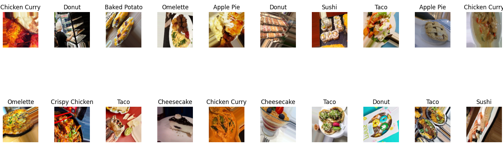

# tc3002b_Modulo2_IA
En este repositorio se alojarán todos los archivos del Módulo 2 de la materia de Desarrollo de aplicaciones avanzadas de ciencias computacionales

## Food Classification

### Dataset

El conjunto de datos utilizado en este proyecto fue creado por Harish Kumar y se obtuvo del conjunto de datos de Kaggle conocido como [Food Image Classification Dataset](https://www.https://www.kaggle.com/datasets/harishkumardatalab/food-image-classification-dataset)

El objetivo principal de este modelo es clasificar 13 categorías diferentes de platillos de comida.

Originalmente, el conjunto de datos de Kaggle incluía 35 clases de platillos, pero para este modelo se redujo a 13, que son las siguientes:
* Apple Pie
* Baked Potato
* Cheesecake
* Chicken Curry
* Crispy Chicken
* Donut
* Fries
* Hot Dog
* Ice Cream
* Omelette
* Sandwich
* Sushi
* Taco

### Estructura del dataset
Las clases tienen una diferencia relevante en la cantidad de imágenes, las siguientes clases poseen 1500 imágenes:
* Baked Potato
* Crispy Chicken
* Donut
* Fries
* Hot Dog
* Sandwich
* Taco

Mientras que el resto de las clases poseen 1000 imágenes, las cuales son:
* Apple Pie
* Cheesecake
* Chicken Curry
* Ice Cream
* Omelette
* Sushi

En el conjunto de datos original de Kaggle, cada clase contiene todas las imágenes sin una estructura definida. Con el fin de mejorar la eficiencia del desarrollo del modelo y reducir posibles desequilibrios, las imágenes de las clases se dividirán en tres categorías principales:

* **Train (Entrenamiento):** Esta categoría se utilizará para entrenar el modelo y contendrá el 70% de las imágenes de cada clase. Se estima que habrá aproximadamente 11,550 imágenes en esta categoría.

* **Validation (Validación):** Aquí se evaluará el rendimiento del modelo durante el entrenamiento, lo que permitirá ajustar los hiperparámetros del modelo antes de pasar a la fase de prueba. Esto nos ayuda a evitar problemas de overfitting (sobreajuste) o underfitting (subajuste) del modelo. La categoría de validación contendrá el 15% de las imágenes de cada clase, aproximadamente 2,475 imágenes.

  **Overfitting (sobreajuste):** Ocurre cuando un modelo se ajusta demasiado bien a los datos de entrenamiento, lo que resulta en un bajo rendimiento con nuevos datos no vistos previamente.

  **Underfitting (subajuste):** Ocurre cuando un modelo es demasiado simple para capturar la estructura subyacente de los datos. 

* **Test (Prueba):** Esta categoría permitirá evaluar el rendimiento del modelo frente a imágenes que nunca ha visto durante la fase de entrenamiento. Contendrá también el 15% de las imágenes de cada clase, aproximadamente 2,475 imágenes.

El conjunto original de datos no venía segmentado en las categorías previamente descritas por lo que se desarolló un archivo de python llamado "data_split.py" para hacer la división de las imágenes.

### Preprocesamiento de los datos

El preprocesamiento de imágenes es una fase relevante para preparar los datos antes de entrenar un modelo de clasificación de imágenes. 

En este proyecto, se utiliza ImageDataGenerator de TensorFlow para realizar una serie de transformaciones en las imágenes del conjunto de datos.

#### **Detalles del Preprocesamiento**

* **Redimensionamiento de Imágenes:** Todas las imágenes se redimensionan a 150x150 píxeles para asegurar una entrada consistente en el modelo, independientemente de las dimensiones originales de las imágenes.

* **Normalización de los valores de los píxeles:** En el preprocesamiento de imágenes para modelos de aprendizaje profundo, una práctica común es escalar los valores de los píxeles de las imágenes al rango [0, 1]. Esto se logra dividiendo cada valor de píxel por 255.

* **Data Augmentation (Aumento de Datos):** Data augmentation se utiliza para incrementar la diversidad del conjunto de datos de entrenamiento mediante la aplicación de transformaciones aleatorias. En este proyecto se establecieron las siguientes transformaciones en el conjunto de entrenamiento:

  * **Rotation (Rotación):** Las imágenes pueden rotar hasta 90 grados.
  * **Width and height shift (Desplazamiento Horizontal y Vertical) :** Las imágenes pueden desplazarse horizontalmente y verticalmente hasta un 20% de su tamaño.
  * **Shear (Corte):** La transformación de corte es una operación geométrica que distorsiona la forma de una imagen. La transformación de corte puede variar aleatoriamente hasta un máximo de aproximadamente 0.2 radianes(11.46 grados).
  * **Zoom:** Las imágenes pueden ser ampliadas hasta un 20%.
  * **Horizontal flip (volteo Horizontal):** Las imágenes pueden ser volteadas horizontalmente.
  * **Class mode (modo de clase):** Este parámetro especifica el formato de las etiquetas que se generarán para los datos. Este parámetro es crucial para determinar cómo se estructuran las etiquetas de salida de las imágenes cargadas y se utiliza para adaptar la forma de las etiquetas a la arquitectura del modelo.En este caso, debido a que el modelo tiene el propósito de clasificar diversas clases, es estableció el parámetro de categorical.

* **Generador de Datos:** ImageDataGenerator genera lotes de datos de imágenes con un tamaño de 64 imágenes por lote (valor definido en el código). Cabe resaltar que para fines didácticos en el archivo "model_preprocess.py" se desarrolla una estructura donde se guarda ejemplos de imágenes aumentadas en la carpeta "augmented" con el prefijo aug y en formato PNG.

A su vez, en el mismo archivo hay una estructura para imprimir alrededor de 20 imágenes, usando librerías de python como numpy y matplotlib, en caso de que no se quiera guardar las imágenes en el dispositivo que se ejecute el código. A continuación se muestra un ejemplo de la imagen que se genera.

En el archivo "model.py", se mantiene la misma arquitectura descrita anteriormente para el preprocesamiento de las imágenes de entrenamiento. Sin embargo, se ha agregado un preprocesamiento similar para los conjuntos de validación y prueba. Es importante destacar que estos preprocesamientos adicionales contienen una arquitectura simplificada que conserva únicamente las etapas de redimensionamiento y normalización, así como la configuración del modo de clase.

Esto se debe a que en los conjuntos de validación y prueba, se busca evaluar el rendimiento del modelo con datos "reales", es decir, imágenes que sean representativas de las condiciones que encontrará el modelo en la práctica. Por lo tanto, se evitan las transformaciones excesivas en estas imágenes, como rotaciones y zoom, para garantizar que las métricas de rendimiento reflejen con precisión la capacidad del modelo para generalizar a datos no vistos sin influencias artificiales.En otras palabras, al mantener los conjuntos de validación y prueba lo más cercanos posible a datos "reales", se obtiene una evaluación más precisa del rendimiento del modelo en situaciones del mundo real.

## Referencias bibliográficas